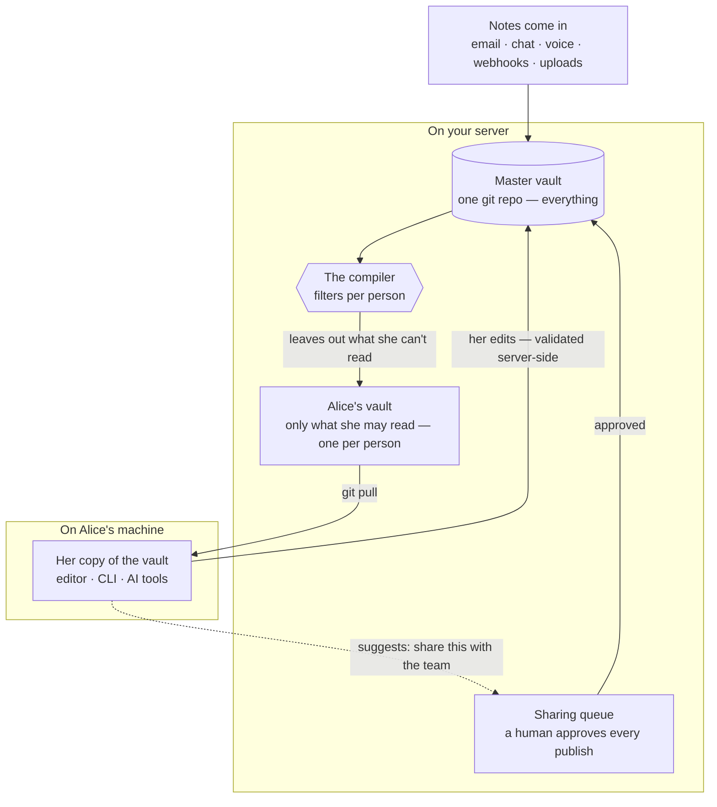
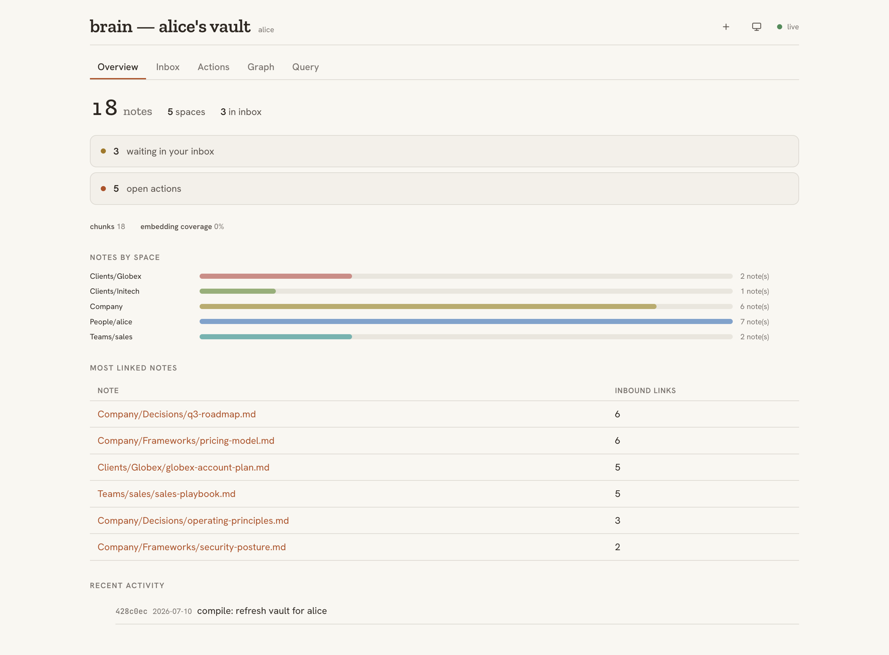
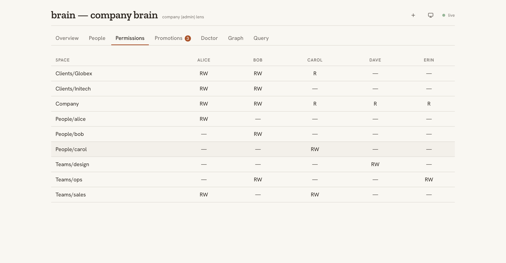

# brainkit

**One brain for the company. A filtered copy for every person.**

Shared team knowledge on plain, Obsidian-compatible markdown and git. A compiler builds each person a copy containing only the notes they're allowed to see — anything else is never on their machine, so there's nothing to leak. Works with the AI tools your team already uses, or with none.


**Prefer pictures?** Three visual walkthroughs, shallow to deep: [the quick version](https://claude.ai/code/artifact/fc1eb4ce-775e-4eaa-84bb-758bc6adbbd4), [how it works](https://claude.ai/code/artifact/d198eb64-b9a7-4aab-bba6-92ab9129cc6a), and [where the brain lives](https://claude.ai/code/artifact/af2936aa-b341-4625-8fda-450f2fa16ae6) — the production deployment architecture.

**The complete system, not a demo.** What you clone is the whole thing: the same code built to run a company's shared brain, with nothing held back for a paid tier. It's early — pre-1.0, installed from source, no PyPI package yet — and honest about its limits, which are spelled out below rather than hidden.

Every team hits the same wall with shared knowledge:

- A wiki nobody updates goes **stale**.
- A tool that auto-copies everything into one place **overshares** — client details, HR notes, and half-formed drafts end up in front of people who were never meant to see them.

brainkit takes the middle path, and makes the "never meant to see it" part a structural guarantee.

## How it works

Your company keeps **one master vault** of notes — plain markdown files, readable in Obsidian or any editor. brainkit builds a **personal copy for each person** that contains only the notes they're allowed to see. Each person works inside that copy, alone or with whatever tools they connect to it.



Sharing something new goes through one door: someone drafts a suggestion ("this looks useful for the whole team") — a person, or an agent acting on their behalf — and a person approves it before it's published. Nothing moves from private to shared any other way.

Want it just for yourself — personal notes, family stuff? Run your own instance as a company of one: [A brain of one](docs/guides/personal-brain.mdx).

## Your knowledge is protected by design

Most tools protect data with permission checks at read time — one misconfigured rule and the note is on screen. brainkit is different: **if a note isn't yours to read, it is never copied to your machine at all.** There is nothing for an app, an AI agent, or a sync bug to leak.

- **Fails closed.** If anything goes wrong while building your copy, you keep the previous copy. A failure can only ever mean you see *less* than you should — never more.
- **Sensitive folders are locked by default.** Client folders are hidden unless someone is explicitly granted access. Forgetting a rule hides a note; it never exposes one.
- **One door for sharing, with a human at it.** Private notes reach the shared brain only through a review queue a person approves — and the destination is checked again at publish time.
- **Every change is on the record.** Everything is a git commit with its own identity — a complete, tamper-evident history of who added what, when.
- **Tested, not just promised.** The test suite generates randomized company layouts seeded with trap notes that must never escape, and verifies they never do.

The deeper story — link stubbing, symlink and path-traversal defenses, the two-phase swap — is in [The compiler](docs/concepts/the-compiler.mdx).

## Works with the tools you already use

The brain is a shared platform for people *and* software. Your team works in Obsidian; agents and any MCP client reach the same vault as a tool, and every one of them inherits the boundary, so an agent can only ever see what its person can see. It's runtime-independent, too: underneath it's plain markdown and git, with no hard dependency on any AI vendor.

- **Claude Code** — zero install. Every compiled vault ships a generated `CLAUDE.md` that carries the working protocol, scoped to that person.
- **Hermes Agent** ([NousResearch](https://github.com/NousResearch)) — first-class support via `hermes profile install`, plus a ready-to-run Docker image in [`deploy/agents-box`](deploy/agents-box).
- **Any MCP client** — `brain mcp` exposes search, note reading, links, recent changes, and time-stamped facts over the Model Context Protocol, so Claude Desktop, Cursor, Codex, and friends can use the vault as a tool.
- **Or no agent at all** — the vault is just files. Obsidian, `grep`, and your editor all work.

## Everything in the box

| | |
|---|---|
| **Capture** | Email, chat (Telegram), voice, file uploads, and signed webhooks (`brain webhook` — Fathom, Zapier, Composio triggers) all funnel through `brain ingest` — one hardened path that refuses unknown senders and path tricks |
| **Search** | Hybrid keyword + semantic search (`brain search`), built per-vault so it can only ever surface notes you're allowed to see |
| **Live user dashboard** | `brain dashboard` in a person's vault — inbox, open actions, notes-by-space, an interactive 2D/3D map of how their notes connect, a Facts tab of time-stamped facts (ask what was true on any date), and search across everything they may see. Updates live over WebSocket; `--html` writes a static snapshot |
| **Admin dashboard** | `brain dashboard` on the master — every person's vault at a glance, the sharing review queue, a read/write permissions matrix, and live `brain doctor` findings (including the name-leak check) |
| **Sharing queue** | `brain promotions` — a person or an agent drafts, a human approves; the only private→shared path |
| **Write-back** | Edits flow back to the master vault with every path validated server-side; one out-of-bounds edit rejects the whole batch |
| **Automation** | `brain cycle` — one cron-able command: apply edits, sweep drafts, rebuild everyone's copy |
| **Health checks** | `brain doctor` — read-only audit for CI or cron; even flags a restricted client's name typed into a shared note |
| **Plain files** | Obsidian-compatible markdown + git — portable, diff-able, yours |

## Built-in dashboards

Run `brain dashboard` and you get a live, self-hosted view of the brain — no extra service, no SaaS. It updates in real time over a WebSocket, and can also export a static HTML snapshot with `--html`. There are two lenses.

**Each person's live dashboard** shows their own vault, and only their own: what's waiting in the inbox, open actions, notes by space, their most-linked notes, an interactive 2D/3D map of how those notes connect, and search across everything they're allowed to see. Notes can be captured straight from the dashboard, too. A Facts tab lists the vault's time-stamped facts — filter by entity or type, or pick a date to see what was true then — and the 2D map rings typed entity pages (clients, people, projects) by type.



**The admin dashboard** is the operator's view of the whole company: every person's vault at a glance, the human-approval sharing queue, live `brain doctor` findings — and a read/write **permissions matrix** that makes "who can see what" impossible to get wrong by accident.



## Deploy it securely

**Everything runs on your infrastructure.** No SaaS, no accounts, no phoning home. Semantic search is optional and points at any OpenAI-compatible embedding endpoint — including one you host yourself, so note text never has to leave your network.

The repo ships the documented [two-box reference deployment](docs/guides/reference-deployment.mdx) used in production:

- A **brain box** holds the master vault and everyone's compiled copies, served over SSH with a restricted, single-purpose key.
- An **agents box** runs one Docker container per person, each mounting *only* that person's vault. The mount is the boundary — an agent physically cannot read a colleague's notes.
- **Encrypted offsite backups**, per-person agent snapshots, supervised sync, and health checks are included as scripts in [`deploy/`](deploy/), not left as an exercise. What gets protected and how each failure recovers: [What survives](https://claude.ai/code/artifact/47825f67-2621-478b-b7ba-d181e6a17f93), or the full [Backups & Restore](docs/guides/backup-restore.mdx) guide.

Start smaller if you like: a single machine and a cron job is a complete, working setup.

## Try it

Five minutes, one machine, no accounts. You need Python 3.12+, [uv](https://docs.astral.sh/uv/), and git.

```bash
# install
uv tool install git+https://github.com/joedanz/brainkit

# create a company vault, describe your people, build everyone's copies
brain init /srv/brain/master --company "Acme Co"
$EDITOR /srv/brain/master/_meta/org.yaml
brain compile --master /srv/brain/master --out /srv/brain/compiled

# check the result
brain doctor --master /srv/brain/master --out /srv/brain/compiled
```

Keep it fresh with two cron lines:

```bash
*/10 * * * * brain cycle  --master /srv/brain/master --out /srv/brain/compiled --index --json
0    * * * * brain doctor --master /srv/brain/master --out /srv/brain/compiled --json
```

Each person then clones their own copy and, if they want, plugs in a tool:

```bash
git clone brain-box:/srv/brain/compiled/alice ~/brain
brain index --vault ~/brain
claude mcp add brain -- brain mcp --vault ~/brain   # any MCP client — optional
```

Full walkthrough: [Getting started](docs/getting-started.mdx) · [Per-employee setup](docs/guides/per-employee-setup.mdx)

## The `brain` command

| Command | What it does |
|---|---|
| `brain init` | Scaffold a new master vault with the default layout and config |
| `brain ingest` | Safely file an incoming note into one person's inbox |
| `brain webhook` | Receive signed webhooks (Fathom, Composio, Zapier…) as inbox notes |
| `brain compile` | Build each person's filtered copy from the master vault |
| `brain writeback` | Apply a person's edits to the master, validating every path |
| `brain promotions` | List, approve, or reject drafts waiting to be shared |
| `brain cycle` | The cron loop: write-back → sweep drafts → recompile |
| `brain index` | Build or refresh a vault's local search index |
| `brain search` | Query a vault — keyword, semantic, or both |
| `brain facts` | Query time-stamped facts (now, as-of, or believed-on a date) |
| `brain mcp` | Serve search, reading, links, recent changes, and facts to MCP clients |
| `brain status` | Counts, freshness, and health at a glance |
| `brain dashboard` | Live local dashboard (or a static HTML snapshot) |
| `brain doctor` | Read-only integrity audit, CI-friendly exit codes |

Flags and exit codes: [CLI reference](docs/reference/cli.mdx).

## Requirements

- **Python 3.12+** and **git**. Runtime dependencies are just `pyyaml`, `sqlite-vec`, and `aiohttp`.
- **Semantic search (optional):** set `BRAIN_EMBED_BASE_URL` to any OpenAI-compatible embedding endpoint. Without it, search runs keyword-only. Note: configuring a provider sends note text to that endpoint — point it at something you host if that matters to you.
- `sqlite-vec` needs a Python whose `sqlite3` was built with **loadable-extension support**. Homebrew, pyenv, uv-managed, and most Linux distro Pythons have it; the common exception is the **python.org macOS installer**, which ships it disabled. Check yours with `python -c "import sqlite3; print(hasattr(sqlite3.Connection, 'enable_load_extension'))"`. If it's unavailable, search degrades gracefully to keyword-only — nothing breaks, you just lose the semantic leg.

## Learn more

- [Getting started](docs/getting-started.mdx) — a working brain in five commands
- [The compiler](docs/concepts/the-compiler.mdx) — why the privacy guarantee is structural
- [Spaces & permissions](docs/concepts/spaces-and-permissions.mdx) — who sees what, and why deny-by-default
- [Promotions](docs/concepts/promotions.mdx) — the human-approved sharing queue
- [Retrieval](docs/concepts/retrieval.mdx) — hybrid search that inherits the boundary
- [Getting things in](docs/guides/getting-things-in.mdx) — email, chat, voice, webhooks, and uploads
- [A brain of one](docs/guides/personal-brain.mdx) — run it solo as a personal brain
- [Reference deployment](docs/guides/reference-deployment.mdx) — the secure two-box setup
- [Backups & Restore](docs/guides/backup-restore.mdx) — encrypted offsite, and the restore drill for every failure
- [Configuration](docs/reference/configuration.mdx) — `org.yaml` and `spaces.yaml`

## Contributing

```bash
git clone https://github.com/joedanz/brainkit && cd brainkit
uv sync --extra dev
uv run pytest
```

The test suite is the contract — especially the no-leak property tests. If you're touching the compiler, ingest, or write-back, start there.

## License

MIT
