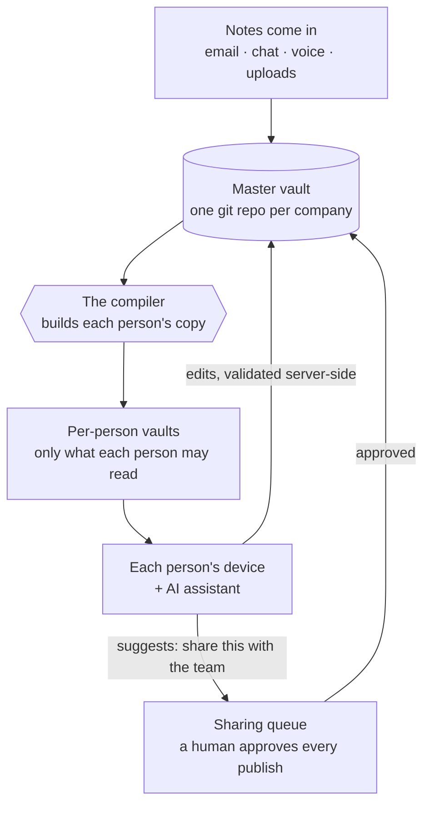

# brainkit

**The self-hosted company brain that keeps private notes private.**

Every person on your team gets an AI-assisted notebook. The company gets a knowledge base that grows from everyone's work — with security built into the architecture, not bolted on.


Every team hits the same wall with shared knowledge:

- A wiki nobody updates goes **stale**.
- A tool that auto-copies everything into one place **overshares** — client details, HR notes, and half-formed drafts end up in front of people who were never meant to see them.

brainkit takes the middle path — and makes the "never meant to see it" part a structural guarantee.

## How it works

Your company keeps **one master vault** of notes — plain markdown files, readable in Obsidian or any editor. brainkit builds a **personal copy for each person** that contains only the notes they're allowed to see, and each person's AI assistant works inside that copy.



Sharing something new goes through one door: your AI assistant drafts a suggestion ("this looks useful for the whole team"), and a person approves it before it's published. Nothing moves from private to shared any other way.

## Your knowledge is protected by design

Most tools protect data with permission checks at read time — one misconfigured rule and the note is on screen. brainkit is different: **if a note isn't yours to read, it is never copied to your machine at all.** There is nothing for an app, an AI agent, or a sync bug to leak.

- **Fails closed.** If anything goes wrong while building your copy, you keep the previous copy. A failure can only ever mean you see *less* than you should — never more.
- **Sensitive folders are locked by default.** Client folders are hidden unless someone is explicitly granted access. Forgetting a rule hides a note; it never exposes one.
- **One door for sharing, with a human at it.** Private notes reach the shared brain only through a review queue a person approves — and the destination is checked again at publish time.
- **Every change is on the record.** Everything is a git commit with its own identity — a complete, tamper-evident history of who added what, when.
- **Battle-tested, not just promised.** The test suite generates randomized company layouts seeded with trap notes that must never escape — and verifies they never do.

The deeper story — link stubbing, symlink and path-traversal defenses, the two-phase swap — is in [The compiler](website/concepts/the-compiler.mdx).

## Works with the AI tools you already use

brainkit is runtime-friendly but runtime-independent: underneath it's plain markdown and git, with no hard dependency on any AI vendor.

- **Claude Code** — zero install. Every compiled vault ships a generated `CLAUDE.md` that carries the assistant protocol, scoped to that person.
- **Hermes Agent** ([NousResearch](https://github.com/NousResearch)) — first-class support via `hermes profile install`, plus a ready-to-run Docker image in [`deploy/agents-box`](deploy/agents-box).
- **Any MCP client** — `brain mcp` exposes search and note reading over the Model Context Protocol, so Claude Desktop, Cursor, Codex, and friends can use the vault as a tool.
- **Or no agent at all** — the vault is just files. Obsidian, `grep`, and your editor all work.

## Everything in the box

| | |
|---|---|
| **Capture** | Email, chat (Telegram), voice, and file uploads all funnel through `brain ingest` — one hardened path that refuses unknown senders and path tricks |
| **Search** | Hybrid keyword + semantic search (`brain search`), built per-vault so it can only ever surface notes you're allowed to see |
| **Dashboard** | `brain dashboard` — live inbox, actions, an interactive map of how notes connect, plus an admin lens with a permissions matrix and the sharing review queue |
| **Sharing queue** | `brain promotions` — agents draft, humans approve; the only private→shared path |
| **Write-back** | Edits flow back to the master vault with every path validated server-side; one out-of-bounds edit rejects the whole batch |
| **Automation** | `brain cycle` — one cron-able command: apply edits, sweep drafts, rebuild everyone's copy |
| **Health checks** | `brain doctor` — read-only audit for CI or cron; even flags a restricted client's name typed into a shared note |
| **Plain files** | Obsidian-compatible markdown + git — portable, diff-able, yours |

## Deploy it securely

**Everything runs on your infrastructure.** No SaaS, no accounts, no phoning home. Semantic search is optional and points at any OpenAI-compatible embedding endpoint — including one you host yourself, so note text never has to leave your network.

The repo ships a documented [two-box reference deployment](website/guides/reference-deployment.mdx):

- A **brain box** holds the master vault and everyone's compiled copies, served over SSH with a restricted, single-purpose key.
- An **agents box** runs one Docker container per person, each mounting *only* that person's vault. The mount is the boundary — an agent physically cannot read a colleague's notes.
- Per-person backups, supervised sync, and health checks are included as scripts in [`deploy/`](deploy/), not left as an exercise.

Start smaller if you like: a single machine and a cron job is a complete, working setup.

## Try it

Five minutes, one machine, no accounts. You need Python 3.12+, [uv](https://docs.astral.sh/uv/), and git.

```bash
# install
uv tool install git+https://github.com/joedanz/brainkit

# create a company vault, describe your people, build everyone's copies
brain init /srv/brain/master --company "Acme Co"
$EDITOR /srv/brain/master/_meta/org.yaml
brain compile --master /srv/brain/master --out /srv/brain/compiled

# check the result
brain doctor --master /srv/brain/master --out /srv/brain/compiled
```

Keep it fresh with two cron lines:

```bash
*/10 * * * * brain cycle  --master /srv/brain/master --out /srv/brain/compiled --index --json
0    * * * * brain doctor --master /srv/brain/master --out /srv/brain/compiled --json
```

Each person then clones their own copy and plugs in their assistant:

```bash
git clone brain-box:/srv/brain/compiled/alice ~/brain
brain index --vault ~/brain
claude mcp add brain -- brain mcp --vault ~/brain   # Claude Code / any MCP client
```

Full walkthrough: [Getting started](website/getting-started.mdx) · [Per-employee setup](website/guides/per-employee-setup.mdx)

## The `brain` command

| Command | What it does |
|---|---|
| `brain init` | Scaffold a new master vault with the default layout and config |
| `brain ingest` | Safely file an incoming note into one person's inbox |
| `brain compile` | Build each person's filtered copy from the master vault |
| `brain writeback` | Apply a person's edits to the master, validating every path |
| `brain promotions` | List, approve, or reject drafts waiting to be shared |
| `brain cycle` | The cron loop: write-back → sweep drafts → recompile |
| `brain index` | Build or refresh a vault's local search index |
| `brain search` | Query a vault — keyword, semantic, or both |
| `brain mcp` | Serve search and note reading to MCP clients |
| `brain status` | Counts, freshness, and health at a glance |
| `brain dashboard` | Live local dashboard (or a static HTML snapshot) |
| `brain doctor` | Read-only integrity audit, CI-friendly exit codes |

Flags and exit codes: [CLI reference](website/reference/cli.mdx).

## Requirements

- **Python 3.12+** and **git**. Runtime dependencies are just `pyyaml`, `sqlite-vec`, and `aiohttp`.
- **Semantic search (optional):** set `BRAIN_EMBED_BASE_URL` to any OpenAI-compatible embedding endpoint. Without it, search runs keyword-only. Note: configuring a provider sends note text to that endpoint — point it at something you host if that matters to you.
- `sqlite-vec` needs a Python built with SQLite extension loading (uv-managed and Homebrew builds have it). If unavailable, search degrades gracefully to keyword-only.

## Learn more

- [Getting started](website/getting-started.mdx) — a working brain in five commands
- [The compiler](website/concepts/the-compiler.mdx) — why the privacy guarantee is structural
- [Spaces & permissions](website/concepts/spaces-and-permissions.mdx) — who sees what, and why deny-by-default
- [Promotions](website/concepts/promotions.mdx) — the human-approved sharing queue
- [Retrieval](website/concepts/retrieval.mdx) — hybrid search that inherits the boundary
- [Getting things in](website/guides/getting-things-in.mdx) — email, chat, voice, and uploads
- [Reference deployment](website/guides/reference-deployment.mdx) — the secure two-box setup
- [Configuration](website/reference/configuration.mdx) — `org.yaml` and `spaces.yaml`

## Contributing

```bash
git clone https://github.com/joedanz/brainkit && cd brainkit
uv sync --extra dev
uv run pytest
```

The test suite is the contract — especially the no-leak property tests. If you're touching the compiler, ingest, or write-back, start there.

## License

MIT
