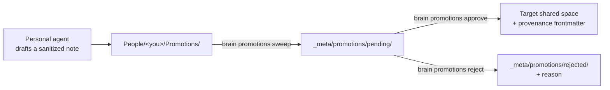

A company brain has two failure modes. A wiki nobody updates **starves**. An auto-sync that copies everything upward **leaks**. Promotions are the middle path: knowledge flows from private to shared, but only through a draft a human approves.

<Callout type="info">
  Promotions are the **only** mechanism that moves content from a more-private
  space to a less-private one. Nothing else in the system copies a note "up."
</Callout>

## The lifecycle



<Steps>
  <Step title="Draft">
    The personal agent spots something promotable — a decision, a reusable client
    fact, an SOP, a lesson — and writes a **sanitized** note (only what is being
    shared) into its own writable space, `People/<you>/Promotions/`, with
    frontmatter naming the `target-path` and the `source` note.

    It writes there, not into `_meta/`, because a personal agent has no write
    access to `_meta/`. That is deliberate: the agent can *propose*, never
    *publish*.
  </Step>

  <Step title="Sweep">
    The server collects agent drafts into the pending queue:

    ```bash
    brain promotions sweep --master /srv/brain/master
    ```

    Malformed drafts are left in place for inspection; symlinked drafts are
    ignored entirely. What lands in `pending/` is a clean, provenance-stamped
    candidate.
  </Step>

  <Step title="Approve or reject">
    An owner reviews the queue and decides:

    ```bash
    brain promotions list    --master /srv/brain/master
    brain promotions approve p-1 --master /srv/brain/master --approver alice
    brain promotions reject  p-2 --master /srv/brain/master --reason "belongs in the sales playbook, not Company"
    ```

    On approval, the note is written to its target space with provenance
    frontmatter (`promoted-by`, `approved-by`, `source`, `date`). Rejections move
    to `rejected/` with the reason — a training signal for what this company
    considers shareable.

    The admin [`brain dashboard`](/reference/cli#brain-dashboard) exposes this same gate as a live surface: the **Promotions** tab renders each pending item with its destination, a warning naming exactly who will be able to read it, and its full body, with **Approve** / **Reject** (reason required) and **Sweep drafts** actions wired to these same primitives. It never bypasses the human gate — it *is* the human gate, with a nicer view.
  </Step>
</Steps>

## Why approval re-validates the target

A pending file sits on disk between draft and approval, where a human edit, a bad merge, or a compromised process could tamper with its `target-path`. So `approve` re-validates the target at the moment it publishes — a hand-edited path that tries to escape the master root, or one that names a private space or a bare space root, is refused. Validation at draft time is not trusted to still hold at approve time.

See the [CLI reference](/reference/cli#brain-promotions) for every promotions subcommand and its exit codes.
