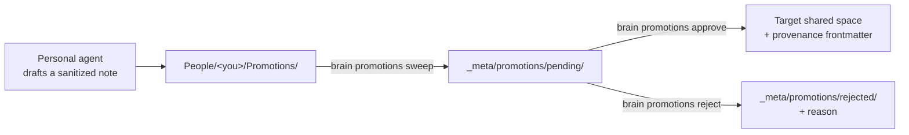

A company brain has two failure modes. A wiki nobody updates **starves**. An auto-sync that copies everything upward **leaks**. Promotions are the middle path: knowledge flows from private to shared, but only through a draft a human approves.

<Callout type="info">
  Promotions are the **only** mechanism that moves content from a more-private
  space to a less-private one. Nothing else in the system copies a note "up."
</Callout>

## The lifecycle



<Steps>
  <Step title="Draft">
    The personal agent spots something promotable — a decision, a reusable client
    fact, an SOP, a lesson — and writes a **sanitized** note (only what is being
    shared) into its own writable space, `People/<you>/Promotions/`, with
    frontmatter naming the `target-path`, the `source` note, and a `mode`:
    `create` (default), `append`, or `patch` — see [modes](#three-modes)
    below. New knowledge — decisions in `Company/Decisions/`, standing
    processes in `Company/Playbook/` — uses the default `mode: create` and
    targets a fresh file. Curated running files like `Company/Memory.md` stay
    maintained by the admin; an agent updates an existing shared page only
    through `append` or `patch`, never by targeting it with `create`.

    It writes there, not into `_meta/`, because a personal agent has no write
    access to `_meta/`. That is deliberate: the agent can *propose*, never
    *publish*.
  </Step>

  <Step title="Sweep">
    The server collects agent drafts into the pending queue:

    ```bash
    brain promotions sweep --master /srv/brain/master
    ```

    Malformed drafts are left in place for inspection; symlinked drafts are
    ignored entirely. What lands in `pending/` is a clean, provenance-stamped
    candidate. For a `mode: patch` draft, sweep also stamps `base-hash` — a
    sha256 of the target file **as it stood at this moment** — into the
    queued promotion; that hash is what approval re-checks before it writes.
  </Step>

  <Step title="Approve or reject">
    An owner reviews the queue and decides:

    ```bash
    brain promotions list    --master /srv/brain/master
    brain promotions approve p-1 --master /srv/brain/master --approver admin
    brain promotions reject  p-2 --master /srv/brain/master --reason "belongs in the sales playbook, not Company"
    ```

    On approval, the note is written to its target space with provenance
    frontmatter (`promoted-by`, `approved-by`, `source`, `date`). The approver
    must be a person id from `_meta/org.yaml` — a blank or unknown name is
    refused, so `approved-by` always points at a real person, the same way
    `promoted-by` does. Rejections move to `rejected/` with the reason — a
    training signal for what this company considers shareable.

    Each decision is also its own git commit in the master — the approval
    under the approver's identity, sweeps and rejections as `Brain
    Promotions` — so the moment a note crossed from private to shared is in
    history alongside every ingest and write-back, whether the decision came
    from the CLI or the dashboard.

    The admin [`brain dashboard`](/reference/cli#brain-dashboard) exposes this same gate as a live surface: the **Promotions** tab renders each pending item with its destination, a warning naming exactly who will be able to read it, a mode badge, and its full body — or, for a `patch`, a live diff against the current target — with **Approve** / **Reject** (reason required) and **Sweep drafts** actions wired to these same primitives. You pick who you are from a dropdown of the org's people (remembered for next time) rather than typing a name, so approvals can't carry a typo. It never bypasses the human gate — it *is* the human gate, with a nicer view.
  </Step>
</Steps>

## Why approval re-validates the target

A pending file sits on disk between draft and approval, where a human edit, a bad merge, or a compromised process could tamper with its `target-path`. So `approve` re-validates the target at the moment it publishes — a hand-edited path that tries to escape the master root, or one that names a private space or a bare space root, is refused. Validation at draft time is not trusted to still hold at approve time.

## Three modes

The safety story isn't "strictly additive" anymore — it's **never destroys**. Each mode makes a different promise about the target, enforced at approval time:

| Mode | Target must be | On mismatch |
|---|---|---|
| `create` (default) | absent | refused — an approval can never silently overwrite a curated file like `Company/Memory.md` |
| `append` | present | refused if the target is missing — nothing to append to |
| `patch` | present **and unchanged since sweep** | refused if the target's sha256 no longer matches the `base-hash` sweep stamped on it |

`create` and `append` each refuse the one target state that would let them do damage — create can't overwrite, append can't invent a page from nothing. `patch` goes further because it replaces the whole file: at sweep time, `brain promotions sweep` hashes the target and stores that sha256 as `base-hash` on the queued promotion; at approval, `approve` re-hashes the live target and refuses to write if it no longer matches. This is deliberately honest about what the hash does and doesn't cover: it guards the pending→approve window (however long that queue sits), but a master edit landing between the agent drafting its patch and the sweep that stamps the hash isn't caught by it — the hash is taken from whatever the target looked like *at sweep time*, not when the agent read it. That's why approval is never just the hash check: `brain promotions show <id>` (and the dashboard's Promotions card) renders a live unified diff of the proposed body against the current target, computed fresh at review time, so the approver's own eyes are the second check.

To resolve a `create` or `append` mismatch, edit the pending file's `target-path` (or its `mode`) and approve again. This is how the [`Company/Intel/` wiki](/guides/getting-things-in#articles-and-links-the-intel-wiki) updates an existing page: the agent promotes with `mode: append` for an additive note, or `mode: patch` carrying the complete revised page, instead of drafting a separate addendum file.

The approver is checked the same way, at every layer: the core `approve` call, the dashboard's API, and the CLI all refuse a blank approver or one that isn't in the org roster. However an approval arrives, the `approved-by` line resolves to a real person.

## Where the person sees status

Once a draft is swept into the queue it leaves the person's space — but not
their sight. Every compile generates a read-only `People/<you>/Shares.md`
into their slice listing everything still pending and the most recent
decisions from the last 30 days, including rejections with their reasons. It is a generated
file (like `AGENTS.md`): write-back ignores edits to it and the next cycle
regenerates it from the queue, so the status a person sees is always the
queue's truth — visible in chat (their agent reads it) and in the dashboard
(it is an ordinary note in Query and the graph).

`Shares.md` isn't only about promotions, despite the name — it's the one status page for everything a person owns or has requested that moves through a human gate. Alongside the promotions status above, it carries a generated **Space shares** section: that person's own pending [share requests](/concepts/spaces-and-permissions#sharing-a-space) (things they've asked to grant on a space they own) plus approvals, rejections, and revocations from the last 30 days, capped at 20. Same generation rule applies — it's regenerated from `_meta/shares/` truth on every compile, not editable in place. Recipients and team leads may also see an **Awaiting your decision** section listing share requests they're eligible to decide themselves — see the routing table in [Sharing a space](/concepts/spaces-and-permissions#sharing-a-space).

See the [CLI reference](/reference/cli#brain-promotions) for every promotions subcommand and its exit codes, and [`brain shares`](/reference/cli#brain-shares) for the share-request queue.
