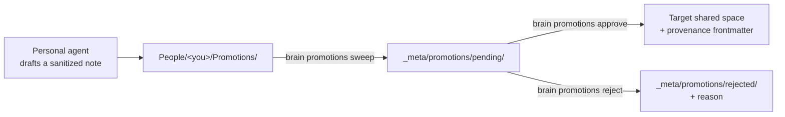

A company brain has two failure modes. A wiki nobody updates **starves**. An auto-sync that copies everything upward **leaks**. Promotions are the middle path: knowledge flows from private to shared, but only through a draft a human approves.

<Callout type="info">
  Promotions are the **only** mechanism that moves content from a more-private
  space to a less-private one. Nothing else in the system copies a note "up."
</Callout>

## The lifecycle



<Steps>
  <Step title="Draft">
    The personal agent spots something promotable — a decision, a reusable client
    fact, an SOP, a lesson — and writes a **sanitized** note (only what is being
    shared) into its own writable space, `People/<you>/Promotions/`, with
    frontmatter naming the `target-path` and the `source` note. The target must
    be a **new** file in the shared space — decisions in `Company/Decisions/`,
    standing processes in `Company/Frameworks/` — never an existing note.
    Promotions add knowledge; curated running files like `Company/Memory.md`
    are maintained by the admin, not replaced by an approval.

    It writes there, not into `_meta/`, because a personal agent has no write
    access to `_meta/`. That is deliberate: the agent can *propose*, never
    *publish*.
  </Step>

  <Step title="Sweep">
    The server collects agent drafts into the pending queue:

    ```bash
    brain promotions sweep --master /srv/brain/master
    ```

    Malformed drafts are left in place for inspection; symlinked drafts are
    ignored entirely. What lands in `pending/` is a clean, provenance-stamped
    candidate.
  </Step>

  <Step title="Approve or reject">
    An owner reviews the queue and decides:

    ```bash
    brain promotions list    --master /srv/brain/master
    brain promotions approve p-1 --master /srv/brain/master --approver admin
    brain promotions reject  p-2 --master /srv/brain/master --reason "belongs in the sales playbook, not Company"
    ```

    On approval, the note is written to its target space with provenance
    frontmatter (`promoted-by`, `approved-by`, `source`, `date`). The approver
    must be a person id from `_meta/org.yaml` — a blank or unknown name is
    refused, so `approved-by` always points at a real person, the same way
    `promoted-by` does. Rejections move to `rejected/` with the reason — a
    training signal for what this company considers shareable.

    The admin [`brain dashboard`](/reference/cli#brain-dashboard) exposes this same gate as a live surface: the **Promotions** tab renders each pending item with its destination, a warning naming exactly who will be able to read it, and its full body, with **Approve** / **Reject** (reason required) and **Sweep drafts** actions wired to these same primitives. You pick who you are from a dropdown of the org's people (remembered for next time) rather than typing a name, so approvals can't carry a typo. It never bypasses the human gate — it *is* the human gate, with a nicer view.
  </Step>
</Steps>

## Why approval re-validates the target

A pending file sits on disk between draft and approval, where a human edit, a bad merge, or a compromised process could tamper with its `target-path`. So `approve` re-validates the target at the moment it publishes — a hand-edited path that tries to escape the master root, or one that names a private space or a bare space root, is refused. Validation at draft time is not trusted to still hold at approve time.

The same check refuses a target that **already exists**. An approval writes the whole note to the target path; if that path held a curated file, approving would silently replace it. Failing closed keeps promotions strictly additive — to resolve the conflict, edit the pending file's `target-path` to a fresh filename and approve again.

The approver is checked the same way, at every layer: the core `approve` call, the dashboard's API, and the CLI all refuse a blank approver or one that isn't in the org roster. However an approval arrives, the `approved-by` line resolves to a real person.

## Where the person sees status

Once a draft is swept into the queue it leaves the person's space — but not
their sight. Every compile generates a read-only `People/<you>/Shares.md`
into their slice listing everything still pending and the most recent
decisions from the last 30 days, including rejections with their reasons. It is a generated
file (like `AGENTS.md`): write-back ignores edits to it and the next cycle
regenerates it from the queue, so the status a person sees is always the
queue's truth — visible in chat (their agent reads it) and in the dashboard
(it is an ordinary note in Query and the graph).

See the [CLI reference](/reference/cli#brain-promotions) for every promotions subcommand and its exit codes.
