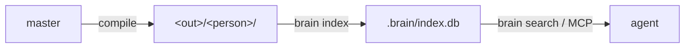

Reading files by hand stops scaling somewhere past a few hundred notes. The
retrieval layer gives every compiled vault a local hybrid search index so an
agent can ask a question and get the right chunks back — while the answer to
"what can this search see?" stays exactly the same as everywhere else in the
system: only what the person may read.

## The boundary comes for free

The index for a person is built **only from their compiled vault** — never from
master. The compiler already removed everything they may not read, so the index
physically cannot contain it. There is no query-time permission filter to get
wrong: retrieval inherits the structural boundary.



This is why there is no "master index filtered per query" option: that would
move enforcement from the compiler (structural) to a filter (a bug away from a
leak). A [randomized leak property test](/concepts/the-compiler) proves no
query for a person ever returns a chunk outside their readable spaces.

## How a query is answered

Search fuses two independent legs and needs no score calibration between them:

- **Keyword** — SQLite FTS5 (BM25) over chunk text.
- **Vector** — semantic nearest-neighbours via [sqlite-vec](https://github.com/asg017/sqlite-vec).
- **Fusion** — reciprocal-rank fusion (RRF): a chunk both legs surface outranks
  one only a single leg found.

Notes are chunked heading-aware (each chunk carries its `Heading > Subheading`
path), code fences are never split, and results are deduped to at most two
chunks per file. If no embedding provider is configured — or `sqlite-vec` can't
load — search degrades to **keyword-only** with a warning, never an empty
result.

## The `.brain/` contract

The index lives at `<vault>/.brain/index.db`. It is **machine-local state**, on
the same footing as `.git`:

- **Never committed.** The compiler emits a `.gitignore` (`.brain/`,
  `.obsidian/`), so it never enters the vault's git history.
- **Rebuilt where it's used.** Employees run `brain index` after they pull;
  hosted agents get theirs from `brain cycle --index` server-side.
- **Preserved across recompiles.** A recompile swaps the vault contents but
  carries `.brain/` across, exactly like `.git`.

## Incremental by design

The compiler does a full rebuild every run, so the indexer diffs the manifest's
per-file sha256 against what the index already holds: unchanged files are
skipped, and a changed file only re-embeds chunks whose content hash misses the
embedding cache. The cache is keyed by `(chunk_sha, model)` and can be shared
across people, so a chunk two vaults have in common embeds exactly once.

## Scale tiers

The vector store sits behind a three-method seam (`add`/`delete`/`knn`), so the
backend swaps without touching chunking, FTS, or fusion. The unit of scale is
one person's vault, not the whole company.

| Corpus (per vault) | Backend | Trade-off |
|---|---|---|
| ≤ 50K pages | sqlite-vec brute-force (default) | Exact KNN, zero infra, single file. Storage grows linearly. |
| 50K–500K pages | + int8 quantization | 4× smaller, near-exact, same file — still linear scan. |
| millions | LanceDB IVF-PQ or sqlite-vec DiskANN | Sublinear ANN; a heavier dependency or a pre-release. |

Ship tier 1; reach for the others only when a real vault crosses the line.

## Using it from an agent

Register the MCP server once and any MCP client (Claude Code, Cursor, Codex,
Claude Desktop) can search the vault as a tool:

```bash
claude mcp add brain -- brain mcp --vault ~/brain
```

It exposes `brain_search` (hybrid search) and `brain_read` (a path-scoped file
read that refuses symlinks, vault escapes, and anything outside a readable
space). See the [CLI reference](/reference/cli) for `brain index`,
`brain search`, and `brain mcp`.
