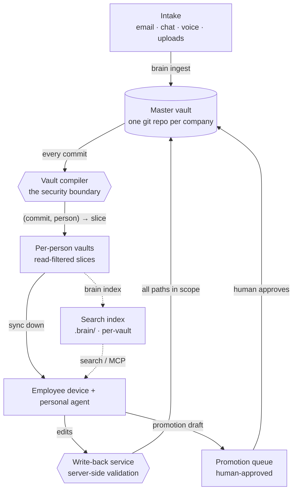

Every employee gets a private, Obsidian-compatible knowledge vault maintained by an AI assistant. The company gets a shared brain that grows from that knowledge — **without private data ever leaking across employees**.

The guarantee that makes this safe is structural: an employee's vault physically contains only the notes they are allowed to read. Privacy is never left to an agent honoring an instruction it could ignore.

<Callout type="info">
  **The one idea to hold onto:** there is a single master vault per company, and a
  compiler produces a filtered *slice* of it for each person. Anything a person
  can't see is never written into their vault, so nothing downstream — sync,
  agents, devices — can leak it.
</Callout>

## How the pieces fit

- **Intake** — notes reach a person's Inbox through `brain ingest`, the safe server-side primitive that email, chat, voice, and upload channels wrap. It can only ever write into that one person's space.
- **Master vault** — the single source of truth and the hard tenant wall. One git repo per company.
- **Compiler** — deterministic `(master commit, person) → filtered vault`. Copies only readable spaces, stubs links to notes the person can't see, and fails closed so a bug can only ever show *less*.
- **Write-back** — validates every changed path against the person's write permissions server-side, then applies to master. One out-of-scope edit rejects the whole change set.
- **Promotions** — the *only* path from a private space to a shared one, and a human gates every one.
- **Retrieval** — each vault gets a local hybrid search index built *only* from its own compiled slice, so search inherits the compiler's boundary — it can't return what the compiler already left out. Reached by CLI or as MCP tools.

## What to read next

<CardGroup cols={2}>
  <Card title="Get started" icon="rocket" href="/getting-started">
    Stand up a master vault and compile per-person slices in five commands.
  </Card>
  <Card title="Getting things in" icon="inbox" href="/guides/getting-things-in">
    How notes reach the Inbox — the `brain ingest` primitive and the channels that wrap it.
  </Card>
  <Card title="Spaces & permissions" icon="shield" href="/concepts/spaces-and-permissions">
    The vault layout and how `spaces.yaml` decides who sees what.
  </Card>
  <Card title="The compiler" icon="lock" href="/concepts/the-compiler">
    Why the privacy guarantee is structural, and what "fail closed" buys you.
  </Card>
  <Card title="Retrieval" icon="search" href="/concepts/retrieval">
    Hybrid search over each vault, with the boundary enforced by construction.
  </Card>
  <Card title="CLI reference" icon="terminal" href="/reference/cli">
    Every `brain` subcommand, its flags, and its exit codes.
  </Card>
</CardGroup>

## Design goals

- **Structural privacy** — the vault contains only what its owner may see, and search inherits that: a per-vault index can't surface what the compiler left out.
- **A brain that feeds itself** — knowledge flows upward through a human-approved queue, so the shared brain neither starves (the wiki failure mode) nor leaks (the auto-sync failure mode).
- **Plain markdown you own** — the whole vault is portable files, readable in Obsidian, GitHub, or any editor.
- **Start small, scale structurally** — the pilot runs 5–25 people; growing to 150+ changes capacity, not architecture.
- **Runtime-friendly, runtime-independent** — first-class support for Hermes Agent and Claude Code, with neither a dependency.
